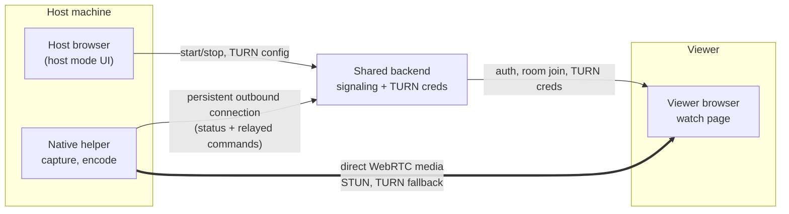

# golive — Native AV1 Broadcast Host

## 1. What this is

A low-latency, zero-cost, small-audience (≤10 viewers) live streaming tool.

- **Viewer**: a web page (`golive.puhl.dev/watch/{roomId}`)  .
- **Host UI**: the *same* web frontend as the viewer (no separate app to build), with a
  "host mode" that unlocks once a native helper is detected as connected — see §3.
- **Native helper**: a small, headless background process (no GUI, not a Tauri app) that
  does the actual screen capture and AV1 encoding, and fans a single encode out to each
  connected viewer directly (mesh — see §3 for why no SFU is used).
- **Transport**: WebRTC mesh — helper connects directly to each viewer (**P2P**). NAT
  traversal uses **STUN only** in v1. **TURN is explicitly deferred to v2/v3** and is not
  built into v1 (see "v1 scope" below).
- **Direct-only v1**: if STUN cannot establish a direct path, the connection stops with a
  clear error ("Direct connection failed…") telling the host their networks can't connect
  directly. There is **no fallback to any shared relay and no GoLive TURN server**, now or
  later. Host-provided TURN is the planned v2/v3 recovery path only.

- **Auth**: a **printed host key** for v1 (room ownership + helper control). **Discord
  OAuth (hosts only) is the last item on the v1 roadmap.** Viewers stay anonymous: the
  room link is enough. There is no viewer allowlist.

Codec scope for v1: **AV1 only**. No fallback codec, no transcoding.

## 1.1 v1 scope (locked decisions)

Applied to the current build; update this section when a decision changes.

- **P2P-first, STUN-only, no TURN.** When a direct path can't be established the
  connection fails with a clear error; no shared/GoLive relay ever. TURN is v2/v3.
- **Printed-key host identity.** The host page is gated by a room key printed by the
  helper. Discord OAuth (hosts only) is the last item on the v1 roadmap.
- **Windows-first helper.** Plain Go binary, no GUI. Linux/macOS capture paths exist in
  code but are unverified. Browser support: modern Chromium only.
- **≤10 concurrent viewers**, one AV1 encoder instance, N fan-out peer connections,
  no SFU.
- **No recording/DVR, no mobile host app, no native GUI/Tauri wrapper, and no
  browser-to-localhost calls of any kind.**

## 2. Constraints (don't violate these)

- **$0 infrastructure cost**, and no shared quota that scales badly as more people run
  this — each host supplies their own TURN relay in v2+, so cost/capacity is distributed
  per host rather than centralized. (v1 has no relay at all, so this already holds.)
- No self-hosted signaling or TURN server run *from the host's own machine*, since the
  operator's router blocks inbound connections — anything that needs a public IP
  (signaling, TURN) runs on a small always-reachable service the host deploys
  ( a small VPS).
- **No direct browser-to-localhost communication.** The host browser and the native
  helper run on the same machine but must never call each other directly. This is
  deliberate: it sidesteps Chrome's evolving Local Network Access / Private Network
  Access restrictions (a permission layer specifically targeting public HTTPS pages
  calling `localhost`/private-network addresses, currently being rolled out and still
  changing) entirely, rather than building against a moving target.
- ≤10 concurrent viewers per room. Do not over-engineer for scale beyond this.
- Host machine may be behind an arbitrary home NAT; assume no port forwarding, no
  static IP, no UPnP guarantee. STUN may be enough; when the network cannot establish a
  direct peer connection, v1 fails with a clear error and v2+ recovers via host-provided
  TURN.
- **Accepted tradeoff**: since there is no SFU, the host's *upload* bandwidth must
  support roughly `bitrate × concurrent viewer count`. Consider surfacing an estimated
  required upload bandwidth in the host UI based on chosen quality × viewer cap.

## 3. Architecture



Note what's *not* there: no line between "Host browser" and "Native helper" — despite
running on the same machine, they never talk to each other directly. Both only ever
connect outward to the shared backend, which relays control commands between them. This
is the mechanism that avoids browser-to-localhost calls entirely (see §2).

(In v1 the TURN parts of this diagram are inert: no TURN config is sent to the backend
and no TURN credentials reach the viewer — the media edge is direct STUN only.)

### Why no SFU

An SFU solves two distinct problems, only one of which still applies here:

1. **Single encode instead of one encode per viewer** — solved without an SFU, since the
   native helper encodes once and duplicates the already-encoded RTP packets across each
   outgoing peer connection (no per-viewer re-encoding).
2. **Single upload instead of one upload per viewer** — an SFU is the only thing that
   removes this, since TURN only relays what it's given; it doesn't multiply it. Without
   an SFU, the helper's upload bandwidth genuinely scales with viewer count. **This is
   the one tradeoff we're accepting**, in exchange for not depending on a shared
   external relay/quota.

If this ever becomes a real problem (helper's upload insufficient for the desired
viewer count/quality), reintroducing an SFU is the fix — flag as a possible v2
direction, not needed now.

## 4. Components

### 4.1 Host browser (UI)

No separate app to build here. The same frontend that serves `watch/{roomId}` gains a
"host mode":

1. When the host page loads, ask the shared backend whether a native helper is currently
   connected for this room (the backend already knows, since the helper maintains a
   persistent connection to it). In v1 the page is gated by the **printed room key**;
   an account-based gate via Discord OAuth is the last item on the v1 roadmap.
2. If connected, unlock host controls: pick capture source, start/stop, show the room
   link, live bandwidth/quality indicator. (TURN configuration UI is v2+, when TURN
   exists.)
3. Every control action is a normal API call to the shared backend (same pattern already
   used for room state) — the backend forwards it to the helper over the existing
   persistent connection. The browser never calls the helper directly.
4. If no helper is connected, show a prompt to download/run it, with no host controls.

### 4.2 Native helper

Headless background process — no GUI window required (a system tray icon for user
comfort is optional, but there's no webview to bundle, so this is not a Tauri app).

Responsibilities:

1. On startup, open a persistent outbound connection (e.g. a WebSocket) to the shared
   backend and authenticate as this host's helper. This connection is both the presence
   signal ("helper is online") and the control channel (receives start/stop/pick-source
   commands relayed from the host browser).
2. Let the backend-relayed commands drive capture source selection.
3. Encode captured frames as AV1, in real time, **once**.
4. Open one WebRTC peer connection per connected viewer, feeding each the **same**
   already-encoded stream (no per-viewer re-encoding) — a `tee` feeding N outgoing
   connections.
5. For each peer connection, use public STUN to establish the **direct P2P path**. If
   direct connectivity fails, surface a clear connection error to the host (in v1 that
   is terminal; in v2+ this is where host-provided TURN becomes the recovery path).
   Never silently fall back to a GoLive/shared relay.
6. Accept any viewer that reaches the room: access is gated only by knowing the room
   link — there is no viewer allowlist.

Suggested implementation:

- **Capture + encode**: GStreamer pipeline.
  - Capture: platform-specific source (`d3d11screencapturesrc`/`dxgiscreencapsrc` on
    Windows, `ximagesrc`/`pipewiresrc` on Linux, `avfvideosrc` on macOS).
  - Encode: try a hardware AV1 encoder first if present (`nvav1enc`, `qsvav1enc`,
    `vaapiav1enc`, `amfav1enc`, or platform equivalent), fall back to `svtav1enc`
    (software, real-time tunable) if none is available.
  - Fan-out: `tee` element feeding N `webrtcbin` instances (one per viewer), each with
    its own ICE configuration — avoids re-encoding per branch.
- **Packaging**: a plain Rust or Go binary is sufficient (single static executable,
  cross-platform, no webview/runtime to bundle). Windows first, since that's most likely
  for screen/game capture; Linux/macOS as stretch.
- Verify current GStreamer element names/plugins against current docs before relying on
  the ones listed above — this area moves.

### 4.3 Host-provided TURN (deferred to v2/v3)

TURN is **not built in v1**. v1 is STUN-only: the helper always attempts direct WebRTC
connectivity and, if no direct path exists, the connection stops with a clear
host-facing error ("Direct connection failed…"). This section is the **v2/v3 design**,
kept here so the future work is documented; none of it is implemented in the current
build.

(In v2+) TURN is not mandatory for every session — only when the host/viewer networks
cannot establish a direct path. The host provides the TURN configuration used by their
room. For the first implementation this can be Cloudflare TURN short-lived credentials;
a later version may support coturn or another host-controlled TURN provider. Do not
build a shared GoLive TURN relay.

Rules (apply to v2+ when implemented):

1. TURN credentials are short-lived and only exposed to the participants that need them.
2. TURN is configured per room; any viewer who has the room link may receive the room's
   TURN credentials (no allowlist gating).
3. If STUN succeeds, no TURN relay is used.
4. If STUN fails and TURN is configured, retry ICE using the host's TURN server.
5. If STUN fails and TURN is not configured, stop and show a clear error such as:
   **"Direct connection failed. The host needs to configure a TURN server for this
   network."**
6. There is **no fallback to a GoLive/shared TURN server**. The project must never
   silently absorb relay bandwidth costs for a host.

### 4.4 Shared signaling and control relay

Can remain a single centralized service , since it carries no
media, just:

1. Room creation and lookup (`roomId` → which helper). Host identity (printed key now,
   Discord OAuth later) and helper control flow through here.
2. SDP offer/answer and ICE candidate relay between helper and each viewer.
3. **The persistent connection from each native helper** (presence + control relay), and
   the corresponding API the host browser calls to issue commands to its own helper.

Because this never carries media, it stays cheap and shareable across many hosts/rooms
without anyone's usage crowding anyone else out.

## 5. First implementation steps

The first milestone is intentionally much smaller than the complete architecture. The goal
is to prove the hardest technical path — **native capture → AV1 encode → one WebRTC viewer**
— before adding permissions, TURN provisioning, or multi-viewer fan-out.

### Milestone 0 — Signaling proof

1. Browser host/viewer as the test harness.
2. Implement the minimum signaling messages needed for one WebRTC connection:
   SDP offer/answer and ICE candidates.
3. Use public STUN only. Do not add TURN yet.
4. Verify that a browser host can connect to a browser viewer and inspect the selected ICE
   candidate pair.
5. Add connection diagnostics: ICE state, selected candidate type (`host`, `srflx`,
   `relay`), RTT, packet loss, bitrate, FPS, and resolution.

**Exit condition:** one browser-to-browser stream works reliably when direct connectivity
is available, and the UI can distinguish direct (`host`/`srflx`) from relayed (`relay`) paths.

### Milestone 1 — Helper presence and control

1. Add the native helper's persistent outbound WebSocket connection to the backend.
2. Implement helper authentication and presence (`online` / `offline`). (v1: printed
   room key; pairing codes are a later distribution milestone.)
3. Add the host-browser command API: start, stop, and basic capture-source selection.
4. Use a stub helper first; it does not need capture or WebRTC yet.
5. Verify that the browser never communicates with `localhost`; all commands travel through
   the backend relay.

**Exit condition:** the host browser can detect the helper and send commands to it end to
end through the backend.

### Milestone 2 — Native AV1 + one viewer

1. Implement Windows screen capture in the helper.
2. Add GStreamer capture → AV1 encoding.
3. Prefer the available hardware AV1 encoder; keep `svtav1enc` as the software fallback
   for development/testing.
4. Produce one real-time encoded AV1 stream.
5. Create exactly one WebRTC peer connection from the helper to one Chrome/Chromium viewer.
6. Use STUN first. Do not require TURN for the test.
7. Validate AV1 playback in the browser with WebCodecs/WebRTC and measure CPU/GPU usage.

**Exit condition:** the native helper captures the desktop, encodes AV1 once, and one
Chromium viewer receives a stable live stream.

### Milestone 3 — [DEFERRED to v2/v3] Host-provided TURN as recovery

**Status: deferred.** Not built in v1. v1 ships STUN-only; when a direct path can't be
established, the helper stops with a clear host-facing error. The text below is the
v2/v3 design.

1. Add the host's TURN configuration/short-lived credential flow.
2. Keep STUN as the first ICE path.
3. If direct ICE fails, retry with the host-provided TURN server.
4. If direct ICE fails and no TURN is configured, show a clear host-facing error instead
   of using any GoLive/shared relay.
5. Log the final ICE candidate type so it is obvious whether the session is direct or
   relayed.

**Exit condition (v2+):** direct sessions work without TURN; NAT combinations that require a
relay work when the host supplies TURN; there is never an implicit GoLive TURN fallback.

### Milestone 4 — Encode once, multiple viewers

1. Keep a single AV1 encoder instance.
2. Fan the already-encoded stream into one WebRTC peer connection per viewer.
3. Start with 2–3 viewers, then test the real target of up to ~10.
4. Measure total host upload (`bitrate × viewers`) and per-viewer bitrate.
5. Monitor CPU/GPU, frame rate, packet loss, RTT, and viewer stability.

**Exit condition:** one encode can feed the target viewer count without per-viewer
re-encoding, and the host UI reports the real upload/quality impact.

### Milestone 5 — Permissions and polish

1. Anonymous viewer join via the room link; **host identity via printed key** in v1.
2. Room link UX and viewer join flow.
3. Helper reconnect/backoff handling.
4. Capture-source picker and bandwidth/connection error indicators.
5. **Discord OAuth (hosts only) + room ownership — LAST item**: account-based gate for the
   host page and account → helper mapping, replacing the printed key.

**Exit condition:** the complete v1 flow works from helper start (prints key) → host page
(key in URL) → host starts stream → viewer joins via the link → direct WebRTC (STUN) →
stream ends. Discord OAuth ships last and is the natural v2 opener.

## 5.1 Implementation priority

The recommended order is (items with an arrow of evidence below the ladder are done):

```text
Browser WebRTC proof (done)
        ↓
Helper presence + control relay (done)
        ↓
Native capture + hardware AV1 + 1 viewer (done)
        ↓
Single encode → 2–3 viewers (done)
        ↓
Single encode → ~10 viewers (done)          ← soak: 10/10 viewers, media flowed to all, one encode (matrix/SOAK-RESULTS.md)
        ↓
Direct-P2P diagnostics + NAT test mode (done)   ← tools/webrtc-check + matrix/ ledger incl. real cross-network NO
        ↓
M6: trickle + failure diagnostics (done)      ← probe trickles like browser; failures explain why (candidate histograms + verdict); validated on real notebook CGNAT cell 2026-09-25
        ↓
M7: NAT regression suite (done)               ← matrix/suite.ps1: loopback+tunnel+no-stun+soak cells, commit-tagged SUITE-RESULTS.md, baseline 4/4 PASS
        ↓
Printed-key identity / anonymous viewers / UX polish (done)
        ↓
↓
Discord OAuth (hosts)        ← DONE on branch feature/discord-oauth (claim + owner via Turso, validated live 2026-09-25)
        ↓
[v2/v3] Host-provided TURN recovery
```

Do not start with TURN infrastructure (deferred to v2/v3), multi-viewer fan-out, or
Discord permissions. Each of those adds another failure domain before the native media
path is proven.

## 6. Open questions to resolve before/while building

- Exact protocol for the persistent helper↔backend connection (WebSocket is the obvious
  default) and its reconnect/backoff behavior if the helper's network blips.
- Where does each host actually run their credential API + coturn? (v2+ — deferred along
  with TURN.) A documented "one-click" deploy target (e.g. a free-tier Fly.io/Oracle
  Cloud VM) would keep this from becoming the new friction point that used to be
  "download an executable."
- Exact current GStreamer fan-out element names — verify against `gst-plugins-rs` and
  core GStreamer docs at build time.
- How do we keep an anonymous room link from being trivially enumerated/abused, now that
  the link alone grants access? (e.g. longer room ids; out of scope for v1.)
- What's the actual bandwidth/quality ceiling to design the UI around, given the
  accepted host-upload-scales-with-viewers tradeoff?

## 7. Explicit non-goals for v1

- No codec other than AV1.
- **No TURN/relay in v1** — direct STUN only; TURN is deferred to v2/v3.
- No support for viewers beyond modern Chromium-based browsers (Safari/iOS AV1 support
  is unreliable — out of scope for now).
- No recording/DVR functionality.
- No mobile host app.
- No SFU (see §3 for why, and the note on revisiting this if helper upload bandwidth
  becomes a real limiting factor).
- No native GUI / Tauri wrapper, and no browser-to-localhost calls of any kind — host
  controls live entirely in the shared web frontend, relayed through the backend.

### Milestone 6 — Maximize direct NAT traversal

The goal of this milestone is to reduce how often a session needs a relay without changing
the core WebRTC architecture. The helper remains responsible for the peer connection, while
the backend continues to handle signaling only.

1. **Use multiple public STUN servers** instead of depending on a single STUN endpoint.
2. **Verify full trickle ICE support** end to end. Every local ICE candidate should be sent
   immediately through signaling, and every remote candidate should be applied as soon as it
   arrives.
3. Keep `iceTransportPolicy` set to `all` so the ICE agent can try direct `host`, `srflx`,
   and peer-reflexive paths (relay candidates will exist from v2 once host-provided TURN
   lands).
4. Do not stop ICE candidate gathering/checks prematurely. Allow the ICE agent to continue
   discovering and testing candidate pairs while the connection is being established.
5. Preserve and expose all useful candidate types in diagnostics: `host`, `srflx`, `prflx`,
   and `relay`.
6. **Prefer IPv6 when a usable IPv6 path exists**, while retaining IPv4 candidates for normal
   home networks.
7. Add detailed ICE diagnostics for failed direct connections:
   - local and remote candidate types
   - candidate pair state
   - selected candidate pair
   - ICE connection state
   - RTT
   - packet loss
   - bitrate
   - connection establishment time
8. Add a dedicated **NAT diagnostics/test mode** so the same helper and viewer can be tested
   from different networks. Record whether each test succeeded directly or failed (v1:
   failure = "needs TURN in v2+"; there is no relay to fall back to).
9. Investigate **UPnP and NAT-PMP/PCP support in the native helper** as an optional enhancement.
   The helper may attempt router-assisted port mapping where supported, but this must remain an
   optimization rather than a requirement. Do not assume a manually opened mapping is useful
   unless the ICE stack is actually using the corresponding socket/port.
10. Test representative difficult network combinations before considering this milestone done:
    - same LAN
    - two normal home routers
    - symmetric/NAT-restricted combinations where possible
    - double NAT
    - CGNAT
    - IPv6-capable networks
    - networks where UDP is restricted

**Exit condition:** direct P2P connectivity succeeds across a broader range of real-world NAT
combinations, and every failure clearly identifies that a direct route doesn't exist. From
v2 the recovery path is host-provided TURN; in v1 it is a clear terminal error.

**M6 progress (2026-09-25):**

- 1 multi-STUN ✅ — helper: 4 servers; browser viewer: 3.
- 2 full trickle ✅ — helper and browser already trickled both ways; the CLI probe
  (`webrtc-check`) only *received* candidates and relied on prflx discovery. It now sends
  every local candidate like the browser (verified: pairs that were `prflx↔prflx` now resolve
  to proper `host↔srflx` once candidates are exchanged).
- 3 policy `all` ✅ · 4 gather-to-complete ✅ · 8 NAT test mode ✅ (matrix/).
- 5/7 candidate & failure diagnostics ✅ — the helper now tracks both sides' candidate-type
  histograms and, on failure, tells the viewer *and* the host table exactly why: which
  candidate types each side saw, whether either side learned no srflx ("STUN/UDP restricted
  there"), or "both reach STUN but no mutual hole-punch (symmetric/CGNAT)". Viewer page shows
  the diagnostic line; `webrtc-check` RESULT carries `remoteCandidates` too.
- 6 prefer-IPv6 ⚠️ investigated, no code: pion v4 has no candidate-type preference knob (only
  global per-IP filters). Dual-stack ICE already offers both address families; where IPv4
  cannot punch, IPv6 succeeds by selection. Documented, not forced.
- 9 UPnP/PCP ✅ decision (deferred): needs a pre-bound UDP socket + goupnp so the mapped
  router port is the one ICE actually uses. Deferred: the recorded matrix NOs are remote-side
  CGNAT, which UPnP (helper-side) cannot help. Revisit if a matrix cell ever implicates the
  helper-side router (e.g. host behind a second NAT that doesn't do UDP forwarding).
- 10 combos: partial — loopback, IPv6 same-network, IPv4-only double-NAT → carrier CGNAT
  (`NO`, fully diagnosed). Added `webrtc-check -no-stun` to log a deterministic
  "STUN/UDP restricted" cell from any network. Two-normal-routers + UDP-restricted cells
  still want a second network (user-side runs).

### Milestone 7 — Connection diagnostics and NAT regression suite

Turn the diagnostics from Milestone 6 into a repeatable test suite so future networking changes
do not silently reduce connectivity.

**M7 progress (2026-09-25):**

- 1 transport-path panel ✅ — viewer badge now reads `direct host` / `direct srflx` / `direct
  prflx` (parens dropped); host viewers table gained an ICE **check** column alongside gather
  and connect (≡ offer→connected).
- 2 recorded metrics ✅ — gather/check/connect timings, selected pair, RTT, loss, jitter,
  bitrate, first-frame, and disconnect reason were already captured (M6); checkMs now also
  surfaced on the host page.
- 3 anonymized results ✅ — `webrtc-check -anon` strips addresses/ports and keeps only
  candidate types + counts for sharing. No telemetry is collected (v1 stays local).
- 4 **regression suite** ✅ — `matrix/suite.ps1`: loopback, tunnel, `-no-stun` and optional
  5-viewer soak cells, each asserting direct/ICE/srflx + RTP>0; appends one row per run to
  `matrix/SUITE-RESULTS.md` tagged with the git commit under test. Baseline 2026-09-25: 4/4
  PASS. Run after any networking change; exit 0 only when nothing regressed.
- 5 hidden-relay visibility ✅ — v1 has no relay by construction; every path is labeled
  `direct …` and failures produce the explaining diagnostic.

### M8 — Discord OAuth (hosts) — in progress on `feature/discord-oauth`

Account-based host gate that replaces the printed key (M5.5 / roadmap last item):

- OAuth flow ✅ — `/auth/discord/login` → Discord authorize (scope `identify`) → callback
  exchanges the code, loads `/users/@me`, issues an HttpOnly session cookie (12 h,
  SameSite=Lax, Secure on https). Single-use `state` nonce (10 min) carries
  `{room, key}` server-side.
- Account → room ownership ✅ — the printed key is the one-time *claim* credential:
  first Discord user who signs in while holding the key binds the room (`rooms.owner`).
  Afterwards the owner controls the room keyless from the public host page; the WS host
  gate accepts key **or** owner session. Non-owners get `?denied=1`, missing key
  `?unclaimed=1`.
- Persistence ✅ — live on **Turso** (`github.com/tursodatabase/libsql-client-go`, pure
  Go, Hrana over HTTPS) with a local `modernc.org/sqlite` fallback; backend chosen by
  `GOLIVE_DB_URL`+`GOLIVE_TURSO_TOKEN`. `rooms` (host_key upserted at every helper
  handshake + owner) and `sessions`. `server/store_test.go` round-trips both backends
  against the real Turso DB. server/.env auto-loads GOLIVE_* (gitignored).
- Graceful fallback ✅ — no `-discord-id/-discord-secret` → `/auth/*` 404, printed-key
  gate unchanged (verified: config `enabled:false`, host WS still rejects without key).
- UI ✅ — host panel Discord banner: bind / sign-in-again / owner / denied / unclaimed
  states; routes to the public page when opened on localhost. `-db`, env fallbacks
  (`GOLIVE_*`) documented.
- ⏳ Final step — the browser click-through: sign into Discord on the public host page and
  claim room `2ea81f3707`. Everything up to the Discord redirect is verified on the live
  stack (Turso-backed, oauth enabled). Owner transfer/avatar listed as follow-ups in
  DISCORD-AUTH.md.

**M8 validation (2026-09-25):** ✅

- User claimed room `2ea81f3707` through the live public stack; ownership persisted to
  Turso (`owner=<discord id>`, `claimed_at` set, host_key retained) — verified by a direct
  Turso read. The last roadmap item is complete on `feature/discord-oauth`.
- Follow-ups parked in DISCORD-AUTH.md (v2 candidates): ownership transfer/unclaim,
  avatar in the host-panel identity line, and the branch decision (merge to main vs keep
  as the v2 opener lane).

1. Add a host/viewer diagnostics panel showing the final transport path:
   `direct host`, `direct srflx`, `direct prflx`, or `TURN relay` (the last only exists from v2).
2. Record ICE gathering time, ICE checking time, time to first decoded frame, selected candidate
   pair, RTT, packet loss, bitrate, and disconnect reason.
3. Store anonymized connection-test results for development/debugging if the project later has a
   suitable telemetry path. Do not collect unnecessary network-identifying data.
4. Build a small matrix of known test networks and repeat it after changes to the helper,
   signaling, ICE configuration, or router/NAT handling.
5. Make direct-vs-failed behavior visible during development so a hidden relay can never
   silently become the default.

**Exit condition:** a networking change can be tested against the same NAT scenarios and the
project can demonstrate whether direct connectivity improved, stayed the same, or regressed.

### Milestone 8 — Optional native NAT-assistance experiments

Only after the normal WebRTC ICE path is stable, evaluate additional native networking features.
These are experiments, not requirements for v1.

1. Prototype UPnP port mapping in the helper.
2. Prototype NAT-PMP/PCP where supported by the router.
3. Compare connection success rates with assistance disabled/enabled.
4. Verify that any mapped port is actually represented by a usable ICE candidate and selected
   by the ICE agent; a router mapping by itself is not enough.
5. Keep the feature opt-in or safely degradable if router discovery/mapping fails.
6. Do not replace WebRTC ICE with a custom NAT traversal protocol at this stage.

**Exit condition:** any native NAT assistance is demonstrably useful on tested networks and does
not make normal connections less reliable. If it provides little benefit, leave it out rather
than adding another permanent dependency.

### Milestone 9 — Distribution and production readiness

Ship the working stream to end users without a dev setup: the operator runs the signaling
backend on a small always-reachable box (initially the developer's notebook behind a
`cloudflared` tunnel, per README), and hosts get the helper as a plain download that pairs
itself.

Locked-in decisions (general-use scope):

- **One operator-hosted instance** for friends/family. A documented self-host path for
  strangers is stretch, not required.
- **Helper download is served by the backend** (`/api/helper/download` + `/api/helper/latest`)
  and surfaced on the host page — no GitHub account needed by end users.
- **Helper auth**: the host page shows a short code the helper exchanges for a stored
  long-lived token in `%APPDATA%\golive`. (The current minimal flow keeps the printed room
  key the helper generates and persists in the same place; pairing replaces the key when this
  milestone is done.)
- **TURN stays manual** (static host-provided credentials) for now; that entire area is
  deferred to v2/v3 anyway. Cloudflare short-lived credential minting is deferred until a
  real user hits a strict-CGNAT network.
- **Windows binaries only**; the SmartScreen unsigned-exe warning is accepted and documented
  for v1.

1. Release pipeline: tuned `--release` profile (LTO, `codegen-units=1`, `panic=abort`,
   strip); `tools/release/build.ps1` builds `golive-helper-{version}-windows-x64.exe` and
   publishes it plus `latest.json` (version, file, sha256) into `server/public/helper/`.
2. Backend serves the helper: `GET /api/helper/latest` (metadata) and
   `GET /api/helper/download` (redirect to the versioned file), plus static `/helper/*`.
3. Host page: with no helper connected, show a download card (version + sha256 + steps);
   with one connected, compare its hello version to `latest` and hint at updates.
4. Pairing + token auth: `POST /api/pair` issues a short-lived code; the helper exchanges it
   (`--pair <code>`) for a long-lived random token (stored hashed); `/ws/helper` accepts
   `Authorization: Bearer <token>` in addition to the session cookie; the host page shows the
   pairing code while the helper is offline.
5. Helper comfort: a system-tray icon (`tray-icon` on a dedicated thread: open host page,
   start/stop, self-test, quit; live tooltip) and an opt-in "start with Windows" toggle so the
   helper is always online.
6. Backend hardening: fail-fast on the default `SESSION_SECRET` unless dev-auth, `GET
   /healthz`, per-IP rate limits (auth, room create, pair), longer room ids (10 chars).

**Exit condition:** a non-developer can — on a clean Windows PC — download the helper from the
host page, run and pair it, start a stream, and have it work on a normal residential network;
and the operator can rebuild/redeploy the backend and helper without helpers silently losing
auth.

## 5.2 Updated implementation priority

After the existing v1 milestones, networking improvements should follow this order:

```text
Milestone 5 complete
        ↓
Multiple STUN servers + full trickle ICE verification
        ↓
IPv6 + complete ICE candidate diagnostics
        ↓
NAT diagnostics/test mode
        ↓
Real-world NAT regression testing
        ↓
Optional UPnP / NAT-PMP experiments
        ↓
[v2/v3] Host-provided TURN as recovery for networks that still cannot connect directly
```

The project should **not** implement a custom Parsec-like UDP protocol or custom NAT traversal
before exhausting the capabilities of WebRTC ICE. The native helper already removes many of the
browser limitations, while WebRTC provides the mature ICE machinery needed for STUN, candidate
pair checks, and (from v2) TURN fallback.

## 5.3 NAT traversal design rules

These rules are intended to prevent later changes from accidentally making direct P2P less
reliable:

- Direct ICE is always attempted before any relay (relay candidates only exist from v2).
- A hidden shared relay fallback must never exist — in v1 there is no relay at all, and in
  v2+ TURN is host-provided only.
- All trickled ICE candidates must be forwarded in both directions.
- Do not discard `host`, `srflx`, or `prflx` candidates just because a relay candidate also
  exists (relay candidates only appear from v2).
- Do not assume the first discovered candidate pair is the final or best path.
- Do not disable IPv6 candidates globally.
- NAT-assistance features such as UPnP/NAT-PMP are optional optimizations, never prerequisites.
- A failed direct connection must produce diagnostics that explain what happened rather than only
  reporting a generic "connection failed" message.
- If direct connectivity is impossible, fail clearly and tell the host what happened. In v1 that
  error is terminal ("Direct connection failed…"); from v2 it should state that host-provided
  TURN configuration is required.